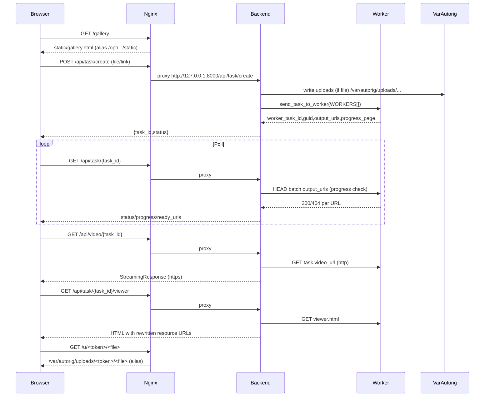
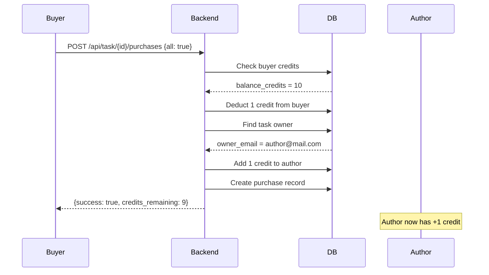

https://autorig.online — web-сервис, который делает авто-риг 3D моделей пользователей (GLB/FBX/OBJ) через пул воркеров-конвертеров.

## PRODUCTION FILE MAP (ОБЯЗАТЕЛЬНО К ПРОЧТЕНИЮ)
Это **истина для продакшена**. Если в репозитории (`/root/...`) что-то отличается — в рантайме важнее **то, что в `/etc` и `/opt`**.

### 1) Исполняемые entrypoints (что реально запускается)
- **Nginx site config (источник истины роутинга/alias/proxy)**: `/etc/nginx/sites-available/autorig.online` (обычно также подключен в `/etc/nginx/sites-enabled/autorig.online`).
- **Systemd unit (источник истины запуска backend)**: `/etc/systemd/system/autorig.service`
  - `WorkingDirectory=/opt/autorig-online/autorig-online/backend`
  - `ExecStart=/opt/autorig-online/venv/bin/python -m uvicorn main:app --host 127.0.0.1 --port 8000`
  - `EnvironmentFile=/etc/autorig-backend.env`
  - `EnvironmentFile=/etc/autorig-telegram.env`

### 2) Исходники/артефакты, которые участвуют в проде (где лежат и за что отвечают)
#### 2.1 Backend (FastAPI)
Директория: `/opt/autorig-online/autorig-online/backend/`
- `main.py`: **FastAPI app** — маршруты страниц (`/`, `/task`, `/admin`, …) и маршруты API (`/api/...`, `/auth/...`), прокси файлов/видео/3D viewer.
- `auth.py`: Google OAuth2 + сессии (используется в `/auth/*` и `Depends(get_current_user)`).
- `config.py`: переменные окружения/константы (WORKERS, лимиты кредитов, UPLOAD_DIR, viewer defaults path, Gumroad mapping, Telegram).
- `database.py`: SQLAlchemy модели (`User`, `Task`, `AnonSession`, `Session`, `GumroadSale`, `ApiKey`) + `init_db()` и `get_db()`.
- `models.py`: Pydantic response/request схемы API.
- `tasks.py`: бизнес-логика задач (создание, прогресс, FBX→GLB pre-step, проверка/скачивание prepared GLB и т.п.).
- `workers.py`: клиент к воркерам (выбор воркера, отправка задач, HEAD-проверки output_urls, очередь воркеров).
- `email_service.py`: email-уведомления (если включено окружением/ключами).
- `telegram_bot.py`: интеграция с Telegram (если включено).

#### 2.2 Frontend (статика, которую отдаёт Nginx по alias)
Директория: `/opt/autorig-online/autorig-online/static/`
- **JS**:
  - `js/app.js`: главная (upload/link, auth status, queue status, history).
  - `js/admin.js`: админка (users/tasks/balance, restart service).
  - `js/i18n.js`: локализация + Telegram WebApp (скрипт тянется на страницах).
  - `js/rig-editor.js`: модуль для task page (rig editor + viewer controls).
- **HTML страницы**: `index.html`, `task.html`, `admin.html`, `buy-credits.html`, `payment-success.html`, `gallery.html`, `g-template.html`, SEO/guide страницы (`glb-auto-rig.html`, `faq.html`, `guides.html`, и т.п.).
- **CSS**: `css/styles.css`
- **Assets**: `images/*`, `i18n/*.json`, `ibl/DefaultHDRISky.exr` и др.

#### 2.3 Deploy-артефакты (лежат в /opt, но “управляют продом” через /etc)
Директория: `/opt/autorig-online/autorig-online/deploy/`
- `nginx.conf`: шаблон/референс для nginx, но источник истины в проде — `/etc/nginx/sites-available/autorig.online`.
- `autorig.service`: шаблон/референс для systemd, но источник истины в проде — `/etc/systemd/system/autorig.service`.
- `cleanup_uploads.sh`: утилита для чистки `/var/autorig/uploads` (обычно должна быть запланирована cron’ом).

### 3) Runtime storage (не в репозитории, но критично для работы)
Директория: `/var/autorig/`
- `uploads/`: временные загрузки пользователя. **Публично раздаётся nginx’ом** как `/u/<token>/<filename>` (alias).
- `viewer_default_settings.json`: глобальные дефолтные настройки 3D viewer (читает/пишет backend).
- `prepared/`: локальный кэш `*_model_prepared.glb` (backend скачивает/кэширует для быстрого viewer на task page).
- `videos/`: кэш/файлы видео-превью (используются в галерее и Telegram).
- `thumbnails/`: миниатюры (если используется пайплайном).
- `viewer_settings/...`: хранилище viewer-настроек (если используется текущей сборкой).

### 4) Важное про “две копии” проекта
- `/root/autorig-online/...` — рабочая/исходная копия (редактирование).
- `/opt/autorig-online/autorig-online/...` — **то, что реально обслуживает прод** (nginx alias + systemd WorkingDirectory).

## Архитектура (высокоуровнево)
- **Frontend**: статические страницы из `autorig-online/static/` (главная, страница таска, админка).
  - **Главная**: `autorig-online/static/index.html`, логика `autorig-online/static/js/app.js`
  - **Task page**: `autorig-online/static/task.html`
  - **Admin**: `autorig-online/static/admin.html`, логика `autorig-online/static/js/admin.js`
- **Backend**: FastAPI `autorig-online/backend/main.py` + SQLite `autorig-online/backend/database.py`
  - Хранит пользователей/кредиты/таски, раздает задачи на воркеры, обновляет прогресс в фоне, шлет email о готовности.
- **Workers**: внешние сервисы конвертации/рига (пул серверов).
  - Список воркеров и базовый endpoint: `autorig-online/backend/config.py` (`WORKERS`).

## Маппинг URL (страницы/статика) → кто обслуживает → какой файл в проде
Источник истины: `/etc/nginx/sites-available/autorig.online` + `backend/main.py`.

### 1) Статика через nginx alias (без участия backend)
- `/static/*` → nginx alias → `/opt/autorig-online/autorig-online/static/*`
  - Примеры: `/static/js/app.js`, `/static/css/styles.css`, `/static/i18n/en.json`, `/static/ibl/DefaultHDRISky.exr`.
- `/gallery` → nginx alias → `/opt/autorig-online/autorig-online/static/gallery.html`
- `/g/<slug>` (regex `^/g/(.+)$`) → nginx alias → `/opt/autorig-online/autorig-online/static/g-template.html`
- SEO/guide страницы → nginx alias → конкретный html в `/opt/.../static/`:
  - `/glb-auto-rig` → `static/glb-auto-rig.html`
  - `/fbx-auto-rig` → `static/fbx-auto-rig.html`
  - `/obj-auto-rig` → `static/obj-auto-rig.html`
  - `/t-pose-rig` → `static/t-pose-rig.html`
  - `/how-it-works` → `static/how-it-works.html`
  - `/faq` → `static/faq.html`
  - `/guides` → `static/guides.html`
  - и прочие seo/локализации (см. полный список файлов в `/opt/autorig-online/autorig-online/static/` и locations в nginx конфиге).
- Верификационные файлы:
  - `/BingSiteAuth.xml` → nginx alias → `static/BingSiteAuth.xml`
  - `/yandex_7bb48a0ce446816a.html` → nginx alias → `static/yandex_7bb48a0ce446816a.html`
- Загрузки пользователей:
  - `/u/<token>/<filename>` → nginx alias → `/var/autorig/uploads/<token>/<filename>`
    - (в backend также есть route `/u/{token}/{filename}`, но в проде nginx перехватывает раньше).

### 2) Прокси на backend (FastAPI)
Эти URL не являются “файлами на диске” (или отдаются backend’ом FileResponse), nginx проксирует на `127.0.0.1:8000`.
- `/api/*` → FastAPI (`/opt/autorig-online/autorig-online/backend/main.py`)
- `/auth/*` → FastAPI (`/opt/autorig-online/autorig-online/backend/main.py`)
- `/` → FastAPI FileResponse → `/opt/autorig-online/autorig-online/static/index.html`
- `/task` → FastAPI FileResponse → `/opt/autorig-online/autorig-online/static/task.html` (task id берётся из query: `?id=<uuid>`)
- `/admin` → FastAPI FileResponse → `/opt/autorig-online/autorig-online/static/admin.html` (только для ADMIN_EMAIL, иначе redirect на `/auth/login`)
- `/buy-credits` → FastAPI FileResponse → `/opt/autorig-online/autorig-online/static/buy-credits.html`
- `/payment/success` → FastAPI FileResponse → `/opt/autorig-online/autorig-online/static/payment-success.html`
- `/robots.txt`, `/sitemap.xml`, `/health` → FastAPI routes (дублируют то, что nginx может отдавать статикой; в проде сейчас проксируются на backend по `location /` если нет отдельного alias).

## Маппинг API → backend модули → кто вызывает (страницы/JS)
Источник истины API: `/opt/autorig-online/autorig-online/backend/main.py` (routes). Бизнес-логика и интеграции: `backend/tasks.py`, `backend/workers.py`, `backend/auth.py`, `backend/database.py`, `backend/email_service.py`, `backend/telegram_bot.py`.

### Auth
- `GET /auth/login`, `GET /auth/callback`, `GET /auth/logout` → `backend/main.py` + `backend/auth.py`
- `GET /auth/me` → `backend/main.py` (response: `AuthStatusResponse`)
  - **Кто вызывает**: `static/js/app.js`, `static/task.html` (и админка косвенно).

### Tasks / Queue / History / Gallery
- `POST /api/task/create` → `backend/main.py` → `backend/tasks.py:create_conversion_task(...)` + списание кредитов / anon usage.
  - **Кто вызывает**: `static/js/app.js`
- `GET /api/task/{task_id}` → `backend/main.py` → `backend/tasks.py:update_task_progress(...)` (если processing / либо done без видео).
  - **Кто вызывает**: `static/task.html` (poll)
- `POST /api/task/{task_id}/restart` → `backend/main.py` → сброс таска + повторный запуск пайплайна.
  - **Кто вызывает**: `static/task.html` + `static/js/rig-editor.js`
- `POST /api/task/{task_id}/retry` → `backend/main.py`
- `GET /api/queue/status` → `backend/main.py` → `backend/workers.py:get_global_queue_status()`
  - **Кто вызывает**: `static/js/app.js`, `static/task.html`
- `GET /api/history` → `backend/main.py` → `backend/tasks.py:get_user_tasks(...)` (user или anon)
  - **Кто вызывает**: `static/js/app.js`, `static/task.html` (owner tasks modal)
- `GET /api/gallery` → `backend/main.py` → `backend/tasks.py:get_gallery_items(...)` (response: `video_url=/api/video/{task_id}`)
  - **Кто вызывает**: динамический UI (на текущем `static/gallery.html` явного fetch не обнаружено — страница выглядит SEO-статикой).

### File/Media proxy (HTTPS)
- `GET /api/video/{task_id}` → `backend/main.py` (StreamingResponse прокси `task.video_url` с воркера)
  - **Кто вызывает**: `static/task.html`, а также возвращается в `GET /api/gallery`
- `GET /api/file/{task_id}/{file_index}` → `backend/main.py` (StreamingResponse прокси `task.ready_urls[file_index]`)
  - **Кто вызывает**: `static/task.html`
- `GET /api/task/{task_id}/progress_log` → `backend/main.py` (получение хвоста/полного лога прогресса с воркера)
  - **Кто вызывает**: `static/task.html`

### 3D viewer proxy + viewer settings
- `GET /api/task/{task_id}/viewer` → `backend/main.py` (проксирует viewer HTML с воркера + переписывает resource URLs на `viewer-resource`)
- `GET /api/task/{task_id}/viewer-resource?path=...` → `backend/main.py` (проксирует ресурсы viewer: `.mview/.json/.png/...`)
- `GET /api/viewer-default-settings` → `backend/main.py` (читает `/var/autorig/viewer_default_settings.json`, fallback на DEFAULT_VIEWER_SETTINGS)
- `POST /api/admin/viewer-default-settings` → `backend/main.py` (admin-only: перезапись `/var/autorig/viewer_default_settings.json`)
- `GET /api/task/{task_id}/viewer-settings` → `backend/main.py` (owner/admin: per-task settings из `tasks.viewer_settings` или default)
- `POST /api/task/{task_id}/viewer-settings` → `backend/main.py` (owner/admin: сохранение per-task settings в БД)
  - **Кто вызывает**: `static/task.html` + `static/js/rig-editor.js`

### Admin
- `GET /api/admin/users` → `backend/main.py` (admin-only)
- `POST /api/admin/user/{user_id}/balance` → `backend/main.py` (admin-only)
- `GET /api/admin/user/{user_id}/tasks` → `backend/main.py` (admin-only)
- `DELETE /api/admin/task/{task_id}` → `backend/main.py` (admin-only)
- `POST /api/admin/service/restart` → `backend/main.py` (admin-only: self-terminate, systemd Restart=always поднимет заново)
  - **Кто вызывает**: `static/js/admin.js`

### Payments / Credits (Gumroad)
- `POST /api-gumroad` → `backend/main.py` → запись `GumroadSale` + начисление `users.balance_credits` (idempotency по `sale_id`)

### Что важно: несоответствия UI ↔ API (чтобы исполнитель не тратил время)
В `static/task.html` есть обращения к endpoint’ам, которых **нет** среди routes в `backend/main.py` (prod):
- `/api/thumb/{task_id}`
- `/api/task/{task_id}/purchases`
- `/api/task/{task_id}/purchase`
- `/api/task/{task_id}/prepared.glb`
- `/api/task/{task_id}/animations.glb`
- `/api/task/{task_id}/animations.fbx`
- `/api/task/{task_id}/model.glb`

Это либо легаси/заготовки UI, либо требования на будущую реализацию.
## Воркеры (ключевая логика)
### Основной процесс (GLB/OBJ/FBX после pre-step)
- Backend отправляет задачу на воркер (один из `WORKERS`) и получает:
  - `worker_task_id`
  - `guid`
  - `output_urls` (список потенциальных выходных файлов по разным форматам/LOD)
  - `progress_page` (если есть)
- Далее backend **не “ждет” воркер**, а периодически проверяет, какие `output_urls` уже доступны, увеличивая `ready_count`, `progress` и заполняя `ready_urls`.

### FBX → GLB pre-step (только если вход .fbx)
- Если входной файл `.fbx`, добавляется этап **FBX→GLB** на тех же воркерах, но через другой endpoint:
  - `/api-converter-glb-to-fbx` (по факту конвертит FBX→GLB и возвращает `output_url` на `.glb`)
- Важно: если воркер вернул `output_url`, считаем, что `.glb` уже готов (не делаем HEAD/GET проверки) и запускаем основной пайплайн сразу на этой ссылке.
- На странице таска показывается отдельный блок статуса **FBX → GLB** + ссылка на скачивание `.glb`.

### Очередь и “свободные воркеры”
- Сервера `5/5` в UI = воркеры отвечают, но не значит что они свободны.
- Чтобы не копить очередь на стороне воркеров, реализована **backend-очередь**:
  - `Task.status="created"` = задача ожидает раздачи.
  - Background dispatcher раз в ~30 сек смотрит статус воркеров и отправляет `created` задачи только на реально свободные.
- Глобальный статус очереди: backend агрегирует данные воркеров и отдает `GET /api/queue/status`.
  - UI форматирует `estimated_wait_seconds` локализованно на фронте (не использует `estimated_wait_formatted`).

## Background worker в бекенде (гарантия “залил и ушел”)
- В FastAPI есть in-process background loop (`background_task_updater()` в `autorig-online/backend/main.py`):
  - раздает queued задачи на свободные воркеры,
  - обновляет прогресс всех `processing` задач,
  - делает это **параллельно с ограничением** (bounded concurrency), чтобы цикл не растягивался на минуты при большом числе задач.
- Backend должен продолжать работу **без фронтенда**: прогресс должен обновляться в БД, и email должен уходить при `done`.
- Рестарт сервера/сервиса:
  - временно прерывает in-process фоновые `asyncio` таски,
  - но состояние задач в БД сохраняется, и после старта сервис продолжает обновления.
  - возможный edge-case: если перезапуск случился в момент FBX pre-step (async task), задача может потребовать ручного restart.

## Таски (UX + API)
- Т1. Страница таска (`autorig-online/static/task.html`) показывает:
  - интерактивный прогресс бар,
  - статус очереди,
  - список готовых файлов,
  - генерацию видео-превью (когда готово),
  - отдельный блок FBX→GLB (если применимо).
- Т2. Restart task:
  - Появляется по таймауту (для `error` — 1 мин).
  - Рестарт выполняется **с тем же `task_id`** (сброс состояния и повторный запуск пайплайна).
- Admin может:
  - смотреть таски пользователя,
  - рестартить,
  - удалять таски,
  - рестартить сервис (чтобы применить изменения).

## Админка
- UI: `autorig-online/static/admin.html` + `autorig-online/static/js/admin.js`
- Backend endpoints в `autorig-online/backend/main.py`:
  - список пользователей, баланс, список тасков
  - restart task
  - delete task (`DELETE /api/admin/task/{task_id}`)
  - restart service (`POST /api/admin/service/restart`)

## Монетизация / кредиты (фримиум)
- Фримиум модель:
  - `free_credits_for_new_users` (анон) = `ANON_FREE_LIMIT` (сейчас 3)
  - кредиты пользователя = `users.balance_credits`
  - списание кредита при создании таска — на бекенде.
- Важно: при 0 кредитов у залогиненного юзера UI ведет на `/buy-credits`.

## Оплата (Gumroad)
- Источник истины: **только webhook** `POST /api-gumroad` (form-urlencoded).
- Idempotency по `sale_id` (повторные пинги не начисляют).
- Привязка покупки к пользователю: `url_params[userid]` = **email пользователя** (не Gumroad email).
- Gumroad email сохраняется отдельно как `users.gumroad_email` (не ключ идентификации).
- BuyCredits:
  - `/buy-credits` — страница покупки + API keys
  - `/payment/success` — информационная страница (не начисляет кредиты)

## Подробный маппинг фич: страницы ↔ API ↔ данные ↔ воркеры
Цель этой секции: чтобы исполнитель сразу видел **где что живёт** (URL → файл/JS → endpoint → таблица/поле → внешний сервис).

### 1) Галерея (Gallery)
Есть 2 слоя, и их нельзя путать:
- **SEO-галерея (статическая страница)**:
  - URL: `/gallery`
  - Кто отдаёт: nginx alias
  - Файл: `/opt/autorig-online/autorig-online/static/gallery.html`
  - Примечание: сейчас это в первую очередь SEO/контент, без явной загрузки данных с `/api/gallery` (в текущем HTML fetch не найден).
- **API-галерея (динамическая выдача задач с видео)**:
  - API: `GET /api/gallery?page=&per_page=`
  - Backend: `backend/main.py` → `backend/tasks.py:get_gallery_items(...)`
  - Источник данных: таблица `tasks` (SQLite), фильтрация “готово + есть видео” (см. реализацию в `get_gallery_items`).
  - Видео отдаётся не прямым worker URL, а через HTTPS-прокси: `video_url=/api/video/{task_id}`.

#### Лайки (Likes)
- **В текущем проде лайки не реализованы**: не найдено таблиц/полей likes в `backend/database.py` и нет API endpoints для лайков в `backend/main.py`.\n- Если “лайки” требуются — это отдельная фича (нужно добавить модель/таблицу, endpoints, и фронт-интеграцию).

### 2) Покупки / кредиты (Gumroad + credits)
- **Начисление кредитов**: только `POST /api-gumroad`.\n  - Idempotency: `gumroad_sales.sale_id` уникальный.\n  - Привязка покупки: `url_params[userid]` = email пользователя (не Gumroad email).\n  - Начисление: `users.balance_credits += credits` (mapping по `GUMROAD_PRODUCT_CREDITS` в `backend/config.py`).\n- **Списание кредитов**: при `POST /api/task/create` (backend).\n  - User: уменьшаем `users.balance_credits`.\n  - Anon: увеличиваем `anon_sessions.free_used` (лимит `ANON_FREE_LIMIT`).\n- **UI страницы**:\n  - `/buy-credits` (покупка)\n  - `/payment/success` (инфо-страница; кредиты не начисляет)

### 3) 3D viewer (два разных режима)
#### Режим A: “viewer от воркера”, но безопасно через backend proxy (mixed content fix)
- URL (внутреннее): `GET /api/task/{task_id}/viewer`\n  - Backend вытягивает viewer `.html` из `task.ready_urls` (ищет `*.html` в quality `_100k/`).\n  - Возвращает HTML, переписывая пути ресурсов на `viewer-resource`.\n- Ресурсы: `GET /api/task/{task_id}/viewer-resource?path=...`\n  - Backend проксирует `.mview/.json/.png/...` ресурсы с воркера.\n- Зачем: воркеры часто отдают по `http://...`, а сайт — `https://...` → иначе браузер режет mixed content.

#### Режим B: “inline Three.js viewer” на странице задачи
- Страница: `/task?id=<task_id>` → файл `/opt/.../static/task.html`.\n- Зависимости:\n  - `three` и loaders/control’ы тянутся с CDN (importmap в `task.html`).\n  - освещение/IBL: `/static/ibl/DefaultHDRISky.exr`.\n  - доп. логика UI: `static/js/rig-editor.js` (ES module).\n- Настройки viewer:\n  - Global defaults: `/var/autorig/viewer_default_settings.json` через `GET /api/viewer-default-settings`.\n  - Per-task persist: `tasks.viewer_settings` через `GET/POST /api/task/{task_id}/viewer-settings`.

### 4) i18n / SEO
- Переводы лежат в `/opt/autorig-online/autorig-online/static/i18n/*.json` и грузятся из браузера как `/static/i18n/<lang>.json`.\n- В nginx на `/static/` стоит long-lived caching (`immutable`), поэтому `static/js/i18n.js` грузит переводы через `fetch(..., { cache: 'no-store' })`, чтобы обновления не “залипали”.

### 5) Админка
- URL: `/admin` (backend проверяет, что `user.email == ADMIN_EMAIL`).\n- UI: `/opt/.../static/admin.html` + `/opt/.../static/js/admin.js`.\n- Возможности:\n  - просмотр пользователей/тасков\n  - изменение баланса\n  - удаление таска\n  - restart backend service (через `/api/admin/service/restart` → self-terminate → systemd поднимет снова)

## Диаграмма: запросы браузера → nginx → backend → воркеры → /var/autorig



## Деплой и статика (важный момент)
- В проде nginx **отдаёт статику alias’ом** из `/opt/autorig-online/autorig-online/static/`, а backend запускается systemd из `/opt/autorig-online/autorig-online/backend/`.
- Значит для обновления UI/бекенда надо деплоить изменения в `/opt/autorig-online/autorig-online/...` и (если нужно) рестартить `autorig.service`.

---

## Галерея (Gallery) — Динамическая

### Основные возможности
- **URL**: `/gallery`
- **API**: `GET /api/gallery?page=&per_page=&sort=&author=`
- **Компонент карточки**: `static/js/task-card.js`

### Сортировка
| Параметр | Описание |
|----------|----------|
| `sort=likes` | По количеству лайков (по умолчанию) |
| `sort=sales` | По количеству продаж |
| `sort=date` | По дате (новые первыми) |

### Фильтрация по автору
- `?author=email@example.com` — показывает только работы конкретного автора
- Комбинируется с сортировкой: `/gallery?author=user@mail.com&sort=likes`

### Response структура
```json
{
  "items": [
    {
      "task_id": "uuid",
      "thumbnail_url": "/api/thumb/uuid",
      "video_url": "/api/video/uuid",
      "like_count": 5,
      "liked_by_me": true,
      "sales_count": 2,
      "author_email": "user@example.com",
      "author_nickname": "username",
      "time_ago": "2 hours ago"
    }
  ],
  "total": 100,
  "has_more": true
}
```

---

## Лайки (Likes)

### Механика
- **Таблица**: `task_likes` (id, task_id, user_email, created_at)
- **API**: `POST /api/gallery/{task_id}/like` — toggle like
- **Требует авторизации**: да (неавторизованные → `/auth/login`)
- Один пользователь = максимум один лайк на задачу

### Response
```json
{
  "task_id": "uuid",
  "like_count": 6,
  "liked_by_me": true
}
```

---

## Авторы (Authors)

### Отображение
- На карточках показывается **никнейм** или **часть email до @**
- Пример: `eschota@gmail.com` → `eschota`
- Если есть `users.nickname` — показывается он

### Клик по автору
- Открывает галерею с фильтром `?author=email`
- SPA навигация на странице галереи (без перезагрузки)

### Данные в БД
```
users.email — идентификатор
users.nickname — опциональный никнейм
tasks.owner_id + tasks.owner_type — привязка задачи к автору
```

---

## Карточки задач (TaskCard Component)

### Файл
`static/js/task-card.js` — переиспользуемый компонент

### Структура карточки
```
┌─────────────────────────────┐
│  [Автор]           [♥ 5]   │
│                    [💰 2]   │
│                             │
│      [ Превью/Thumb ]       │
│                             │
└─────────────────────────────┘
```

### Элементы
| Элемент | Позиция | Действие |
|---------|---------|----------|
| Бейдж автора | top-left | Клик → фильтр по автору |
| Кнопка лайка ♥ | top-right | Toggle like (auth required) |
| Бейдж продаж 💰 | top-right | Только если sales > 0 |

### CSS классы (префикс `tc-`)
- `.tc-card` — контейнер карточки
- `.tc-media` — область превью
- `.tc-author` — бейдж автора
- `.tc-like` / `.tc-like.liked` — кнопка лайка
- `.tc-badge` — бейдж продаж

---

## Продажи / Покупки (Sales & Purchases)

### Модель монетизации
1. **Создание задачи — бесплатно**
2. **Скачивание файлов — за кредиты**:
   - Все файлы сразу: **1 кредит**
   - Отдельный файл: **1 кредит**
3. **Автор получает выплату**: 1 кредит за каждую покупку его работы

### Таблица
```sql
task_file_purchases (
  id INTEGER PRIMARY KEY,
  task_id VARCHAR(36),
  user_email VARCHAR(255),
  file_index INTEGER,  -- NULL = все файлы
  credits_spent INTEGER,
  created_at TIMESTAMP
)
```

### API
| Метод | URL | Описание |
|-------|-----|----------|
| GET | `/api/task/{task_id}/purchases` | Состояние покупок |
| POST | `/api/task/{task_id}/purchases` | Купить файлы |

### Request примеры
```json
// Купить все файлы (1 кредит)
{ "all": true }

// Купить отдельные файлы (1 кредит каждый)
{ "file_indices": [0, 2, 5] }
```

### Response
```json
{
  "success": true,
  "purchased_all": true,
  "purchased_files": [0, 1, 2, 3, 4, 5, 6, 7, 8],
  "credits_remaining": 25
}
```

### Бесплатный доступ
- **Владелец задачи** — полный доступ к своим файлам
- Остальные (включая админа) — должны покупать

### Выплата автору (Creator Payout)
При покупке:
1. У покупателя списывается N кредитов
2. Автору задачи начисляется N кредитов
3. Автоматически в момент транзакции

### Счетчик продаж
- `sales_count` = COUNT(DISTINCT user_email) для task_id
- Считаются уникальные покупатели, не количество файлов
- Отображается на карточке как 💰 N

---

## UI Компоненты

### Header (`static/js/header.js`)
- Логотип + навигация
- Бейдж кредитов
- Google авторизация
- Поиск Free3D моделей
- Переключатель языка (EN/RU/ZH/HI)
- Переключатель темы (☀️/🌙)

### Footer (`static/js/footer.js`)
- 4-колоночный layout:
  - **Brand**: логотип + описание
  - **Services**: GLB/FBX/OBJ авто-риггинг, галерея
  - **Guides**: SEO-страницы руководств
  - **Company**: guides, how-it-works, faq, buy-credits, API
- Telegram ссылка
- © 2026 AutoRig Online

### i18n (`static/js/i18n.js`)
- Локализации: `en`, `ru`, `zh`, `hi`
- Файлы: `static/i18n/*.json`
- Авто-переключение href для локализованных страниц
- Сохранение языка в localStorage

---

## Схема данных (основные таблицы)

```sql
-- Пользователи
users (
  email VARCHAR(255) PRIMARY KEY,
  balance_credits INTEGER DEFAULT 30,
  nickname VARCHAR(100),
  gumroad_email VARCHAR(255),
  created_at TIMESTAMP
)

-- Задачи
tasks (
  id VARCHAR(36) PRIMARY KEY,  -- UUID
  owner_id VARCHAR(255),       -- email или anon_session_id
  owner_type VARCHAR(10),      -- "user" | "anon"
  status VARCHAR(20),          -- created|processing|done|error
  video_ready BOOLEAN,
  video_url VARCHAR(500),
  ready_urls JSON,
  created_at TIMESTAMP
)

-- Лайки
task_likes (
  id INTEGER PRIMARY KEY,
  task_id VARCHAR(36),
  user_email VARCHAR(255),
  created_at TIMESTAMP,
  UNIQUE(task_id, user_email)
)

-- Покупки файлов
task_file_purchases (
  id INTEGER PRIMARY KEY,
  task_id VARCHAR(36),
  user_email VARCHAR(255),
  file_index INTEGER,      -- NULL = все файлы
  credits_spent INTEGER,
  created_at TIMESTAMP
)

-- Gumroad продажи (webhook idempotency)
gumroad_sales (
  sale_id VARCHAR(255) PRIMARY KEY,
  user_email VARCHAR(255),
  product_permalink VARCHAR(255),
  gumroad_email VARCHAR(255),
  created_at TIMESTAMP
)

-- Анонимные сессии
anon_sessions (
  session_id VARCHAR(36) PRIMARY KEY,
  free_used INTEGER DEFAULT 0,
  created_at TIMESTAMP
)
```

---

## Диаграмма: Покупка файлов



---

## Страница задачи (Task Page)

### URL
`/task?id={uuid}`

### Основные блоки
1. **3D Viewer** — интерактивный просмотр модели (Three.js)
2. **Прогресс** — статус обработки и прогресс-бар
3. **Видео превью** — автогенерируемое видео после завершения
4. **Список файлов** — скачиваемые результаты
5. **Карточка автора** — информация о владельце задачи
6. **Кнопки покупки** — "Скачать всё" или отдельные файлы

### Viewer настройки
- Глобальные: `/var/autorig/viewer_default_settings.json`
- Per-task: `tasks.viewer_settings` (JSON)
- API: `GET/POST /api/task/{id}/viewer-settings`

### Файлы для скачивания (типичный набор)
- `*_rigged.glb` — ригнутая модель GLB
- `*_unity.fbx` — экспорт для Unity
- `*_unreal.fbx` — экспорт для Unreal
- `*_100k/*.html` — 3D viewer
- `*_video.mp4` — видео превью
